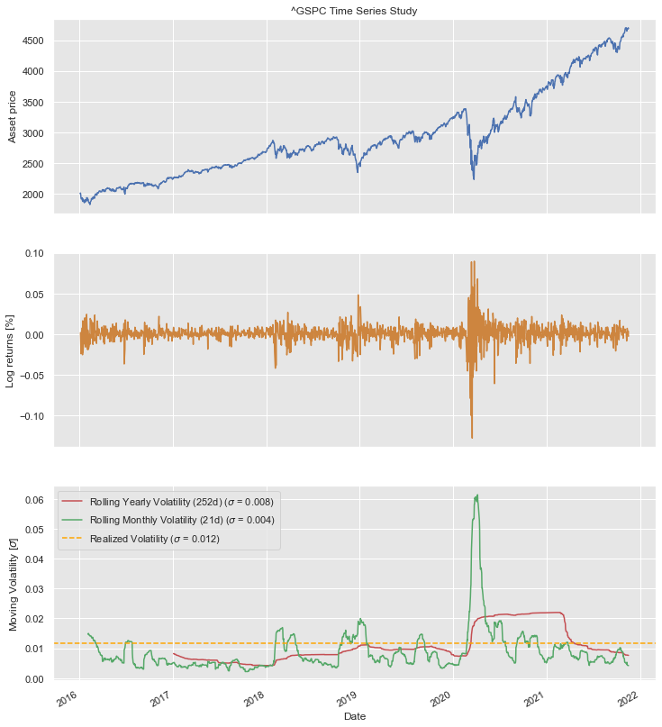
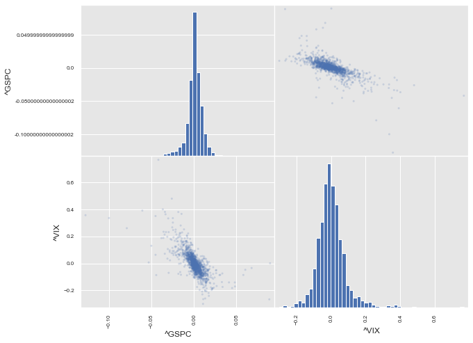
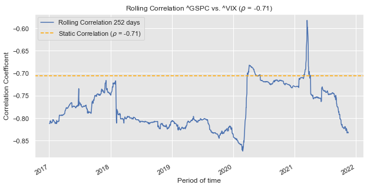
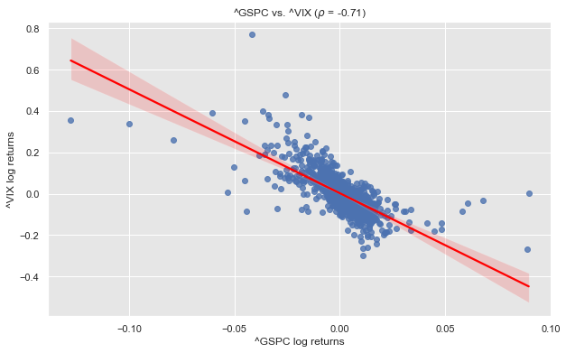

# The idea
The idea of this script, is provide a set of practical tools which will allow the user to extract metrics which are useful to observe either indiviudal assets or compare pairs/groups of them. Going through the code step by step, the user will have access to some metrics which are practical when doing portfolio analysis, hedging, market strategies among other research.

## Index
1. Data Processing
    1.1 User Inputs
    1.2 Data Retreival & Cleasing
    1.3 Data Upgrade
    1.4 Data Visualization
        1.4.1 Single Chart
        1.4.2 Full Sheet
        1.4.3 Scatter Matrix
2. Correlation Coefficient & Regression Analisys
    2.1 Correlation Coefficient & Diversification
    2.2 Rolling Correlation
    2.3 Linear Regression, first approach
3. Wrapping up
4. Final considerations
5. References
6. What's comming next

## How are we going to do it?

It will be focused 100% on the practical aspects, easy to use and with references to theoretical content when needed. The user will be able to use the script only by modifiying the assets on the cell dedicated to it.

This script pretends to be the first of a series where we provide a toolbox over the first steps on asset comparison analysis and other common topics what you can read on What's comming next section.

## Data Retreival & Cleasing

Automated data retreival for the asset to observe and visualization on metrics such (Volatility - Rolling Volatility - Logarithmic Returns - Closing Price).

## Scatter Matrix

To facilitate the visualization of correlations in a graphic manner over the asset required.

## Rolling / Static Correlation

To determinate how this is changing over time and what is the current scenario.

## Introduction to Regression Analysis

With the idea of explore deeper this feature on next stages.

